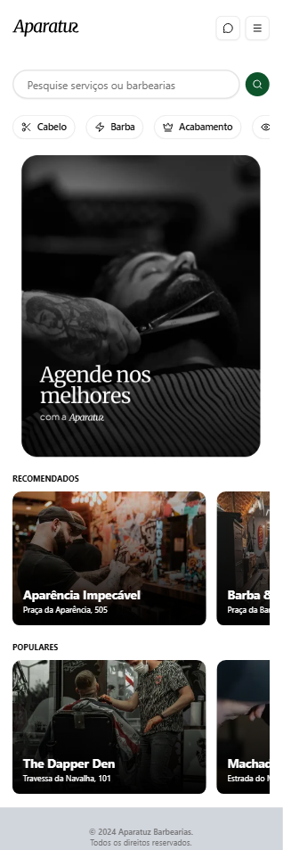
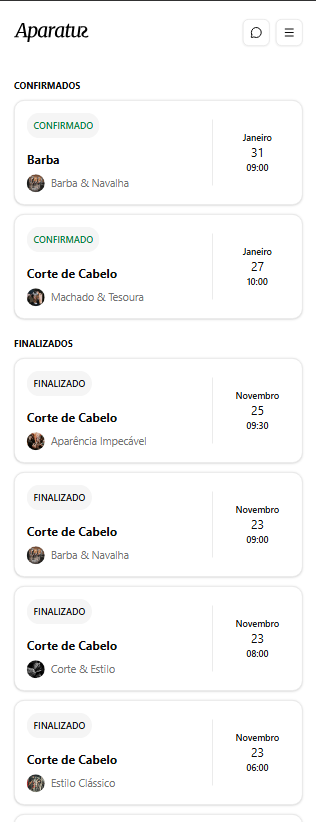
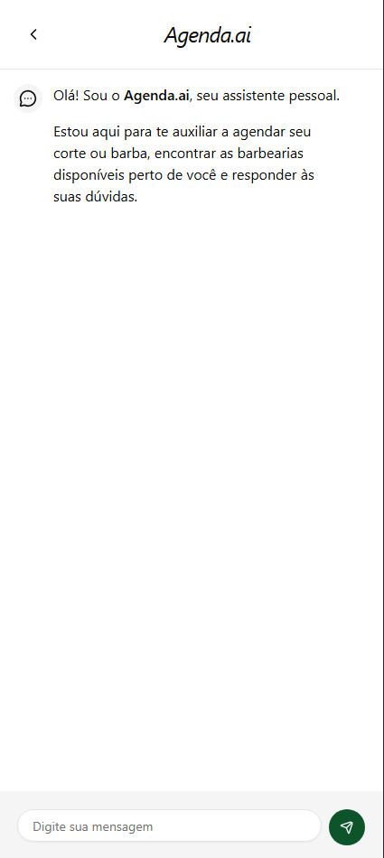

# saas-barberia

O SaaS Barbearia é uma aplicação para gestão de agendamentos e clientes para barbearias. Feito para pequenas barbearias que precisam digitalizar agendamentos e melhorar a experiência do cliente.

\\
\\

## Principais features

- Agendamento online com controle de horários
- Cadastro e histórico de clientes
- Autenticação com OAuth
- Chat para atendimento com IA

## Tech stack

- Front-end: React / Next.js
- Back-end: Node.js
- Banco: PostgreSQL
- Deploy: Vercel

Clique [aqui]("https://saas-barbearia-n8rt.vercel.app/") para acessar a aplicação.
