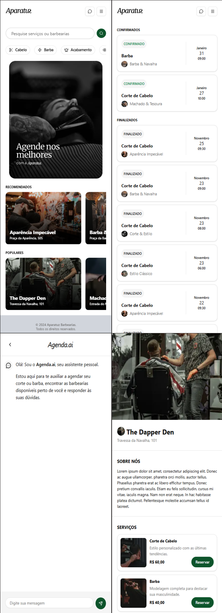

# saas-barberia

O SaaS Barbearia é uma aplicação para gestão de agendamentos e clientes para barbearias. Feito para pequenas barbearias que precisam digitalizar agendamentos e melhorar a experiência do cliente.



## Principais features

- Agendamento online com controle de horários
- Cadastro e histórico de clientes
- Autenticação com OAuth
- Chat para atendimento com IA
- Mobile First

## Tech stack

- Front-end: React / Next.js
- Back-end: Node.js
- Banco: PostgreSQL

## Instalação (Desenvolvimento)

- Clone o repositório e entre na pasta:

```code
git clone https://github.com/leopinheirosilva/saas-barbearia.git
cd saas-barbearia
```

- Configure variáveis de ambiente (crie um `.env` a partir do `.env.example`)

- Instale as dependências:

`npm install`

- Rode a aplicação:

`npm run dev`

## Deploy

- Vercel

clique [aqui](https://saas-barbearia-n8rt.vercel.app/) para acessar o site!

## Contato

Email: <leonardopinheirosilva16@gmail.com>

LinkedIn: <https://www.linkedin.com/in/leonardo-pinheiro-13ba26281/>
